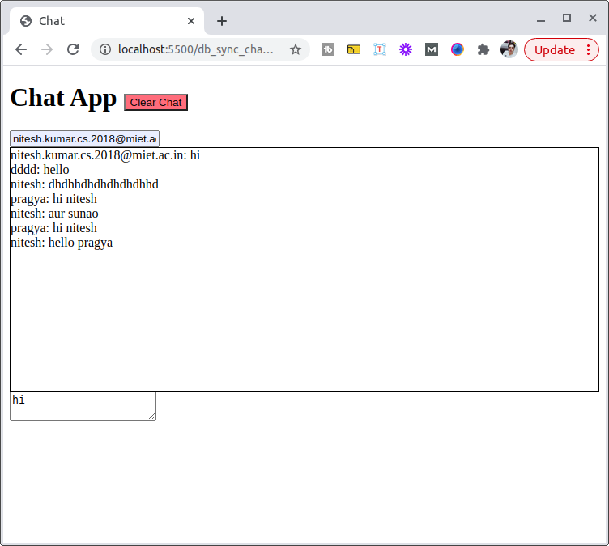

# socket_project_directory

## Overview 
> in this we divide this project in 2 modules `client` and `server`

### Client Side OverView 

1. at first we do setup ton listen for events on give url so for this first we use socket client library
2. then after successful connection we will set the events which we want to listen to perform some action. so `on` function is there in socket so we listen for events `output` , `cleared` and `status`. in output we list down all the messages , in cleared we list set the status text to cleared.
3. at client side we also use emit function to push the event towards backend. so `emit` for `input` and `clear`. on input we sent the message payload to backend and on clear we send msg to backend to clear the chat history

### Server Side OverView

1. in this first we create a listner at specified port by using `express` framework and pass that listener into socket `listen` function.
2. then we connect to mongo db on specified `uri` by creating a mongo client and then specify the db to use and create a collection and find for the chat history in the db.
3. now using socket `emit` function emit the event by name `output` and send data . we use to `on` in backend side `input` and `clear`, for input we save the data as new document and on clear we clear the db.

### How To Run This Project
## prerequisite
1. install node on your system
## How to run
1. clone this repo and cd to repo/db_sync_chat_app
2. cd to server and run `npm i` and then start the server by `npm start`.
3. cd .. and move to client folder by cd client and open index.html in browser

> client output

